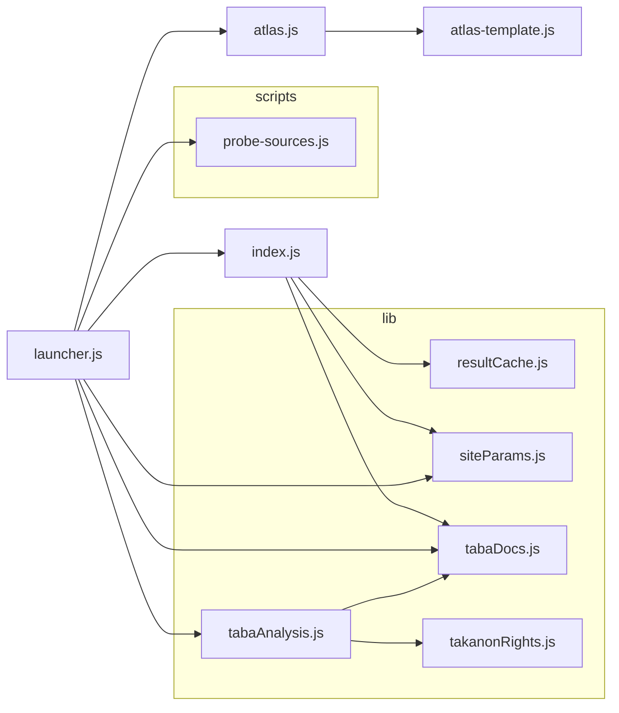

# Structure record — map-context (Layers 2–3)

Per-repo half of the layered structure record for the three-system group (cuboid-studio ·
map-context · archthesis). Layers 0–1 (system map, cross-system contracts) live in
`cuboid-studio/docs/SYSTEM-STRUCTURE.md`. Every claim cites `file:line` at the commit under
**Extracted**.

The server is `launcher.js` (Express, `package.json` `"start"`); the analysis engine is
`index.js` (`runAnalysis` at `index.js:2933`).

---

## Layer 2 — Data schemas

### 2.1 `POST /analyze` — the result object

`launcher.js:127-152`. Request body `{ address (required string), lat?, lon?, radius? }`; valid
in-bounds client coordinates override re-geocoding the address (`:141-146`). CORS is wildcard
(`:128-130`). Errors: 400 missing address, 422 geocoding failure, 500 otherwise (`:148-151`).

Response = `runAnalysis`'s `{ html, data }` (`index.js:3081`): `html` is the complete dashboard
page; `data` is the analysis object assembled at `index.js:3054-3075`:

| Field | Shape |
|---|---|
| `site_center` | `{ lat, lon }` |
| `site_radius` | number (m) |
| `address` | string |
| `layerSources` | `{ buildings, trees, registration, streets }` — provider id or `"none"` (`:3037-3042`) |
| `elevation` | number \| null |
| `buildings` · `streets` · `trees` · `institutions` · `registration` | GeoJSON FeatureCollections |
| `transit` | `{ lightrail, train }` GeoJSON FCs |
| `demographics` | CBS data \| null (null when deferred) |
| `demographicsUrl` | `/cbs-data?lat&lon` \| null — poll target when demographics are deferred (`:3070-3072`) |
| `taba` | plan data \| null |

This same `data` object is what the dashboard posts to an embedding parent as
`analysis-complete` (contract detail in the cross-system doc, Layer 1 §3).

**Result cache**: successful runs are cached on disk keyed by
`lat.toFixed(4),lon.toFixed(4),radius` (+`-fast` for deferred-CBS runs) —
`lib/resultCache.js:18-21`, used at `index.js:2958-2962,3077`. Cuboid's iframe uses the same
rounded identity for its "same site" checks.

### 2.2 `POST /run` — SSE progress events

`launcher.js:183-227`. Same body as `/analyze`; responds as a `text/event-stream`
(`:194-197`). Three event kinds (`sendEvent`, `:198-204`):

| Event | Payload | Source |
|---|---|---|
| *(default/unnamed)* progress | `{ step, label, percent }` | emitted by `runAnalysis`'s callback — e.g. `geocoding` 5 %, per-layer steps (`index.js:2985` maps engine steps to percents), `compiling` 95 %, `done` 100 %; a cache hit short-circuits to `done`/"Loaded from cache" (`index.js:2946-2962,3050,3079`) |
| `complete` | `{ html }` — the dashboard page, with the `analysis-complete` postMessage script injected before `</body>` (`launcher.js:216-220`) | `:222` |
| `error` | `{ message }` | `:224-226` |

### 2.3 What the dashboard consumes

The dashboard is a self-contained HTML page templated by `buildHTML` (`index.js:3052`); its data
arrives three ways:

1. **Embedded constants** baked into the page (`index.js:2180-2189, 2575`):
   `DATA_BUILDINGS`, `DATA_STREETS`, `DATA_TREES`, `DATA_REGISTRATION`, `DATA_INSTITUTIONS`,
   `DATA_LIGHTRAIL`, `DATA_TRAIN` (GeoJSON), `SITE_CENTER {lat, lon}`, `SITE_RADIUS`, and
   `DATA_TABA`. Rendered as Leaflet layers (`:2216-2240`); also the inputs to the SVG/OBJ
   exports (Layer 1 §4 in the cross-system doc).
2. **Deferred fetches** back to the launcher: demographics from `GET /cbs-data?lat&lon`
   (`launcher.js:41`) when the run deferred CBS; TABA plan analysis from
   `GET /taba-analysis/:plan` (`:107`) and plan documents from `GET /taba-docs/:safe/:file`
   (`:24`).
3. **The 3D atlas** in a nested iframe: `GET /atlas?lat&lon&r&label` (`launcher.js:239`),
   generated by `atlas.js` from OSM data and cached on disk.

Remaining endpoints for completeness: `GET /search` and `GET /reverse` (Nominatim proxies,
`launcher.js:163,80`), `GET /probe` (`:66`), `GET /vendor/three.module.js` (`:271`), and
`GET /` — the picker page, which also accepts the boot params `?lat&lon&address&r` that
cuboid-studio sets on its iframe (`:286`).

---

## Layer 3 — Module & flow architecture

### 3.1 Module dependency graph

Generated by dependency-cruiser (exact command under **Regenerate**). The codebase is small
enough to record at module level — no collapsing needed. dependency-cruiser parses the CommonJS
`require()` graph directly.



Reading notes:

- `launcher.js` (the Express server, `package.json` `"start"`) is the root: it requires the
  analysis engine `index.js`, the atlas generator `atlas.js`, and the helper libs
  (`launcher.js:7-11`). It also requires `scripts/probe-sources.js` lazily inside the `/probe`
  endpoint — the data-source probe script doubles as that endpoint's implementation
  (`launcher.js:66,70`).
- `index.js` is the largest module by far and internally spans engine + dashboard template +
  dashboard client script (the `DATA_*`/export code in Layer 2 §2.3 is emitted text, not a
  module edge — it never appears in this graph).
- `atlas.js` → `atlas-template.js`: the 3D atlas page is generated from a template module, same
  pattern as `index.js`'s inline dashboard.
- One-file "flow trace" note: a request enters `launcher.js` (`/analyze` `:127` or `/run`
  `:183`) → `runAnalysis` (`index.js:2933`) → provider fetch chain (Overpass/GovMap/TLV
  GIS/CBS/TABA helpers, incl. `lib/tabaAnalysis.js` → `lib/tabaDocs.js`/`lib/takanonRights.js`)
  → `buildHTML` (`index.js:3052`) → cached via `lib/resultCache.js` → response. The cross-repo
  pipeline continuation (postMessage into cuboid) is Layer 1 §3 of the cross-system doc.

---

## DRIFT

- This repo has no `CONTEXT.md`, so there are no context-sync deltas to record here. (The
  repo-level review docs under `docs/` describe known gaps — e.g. `docs/AUDIT_2026-07-12.md` —
  and were not re-verified in this pass.)

## Regenerate

```bash
# Re-verify Layer 2 claims (from the repo root):
grep -nE "app\.(get|post)\(" launcher.js              # endpoint inventory
sed -n '127,160p;183,230p' launcher.js                # /analyze and /run contracts
sed -n '3054,3081p' index.js                          # analysis data object
grep -n "DATA_[A-Z_]* = |SITE_CENTER|SITE_RADIUS" index.js   # dashboard constants
sed -n '14,21p' lib/resultCache.js                    # cache key

# Regenerate the Layer 3 module graph (exact command used; no repo installs — npx only):
npx --yes dependency-cruiser@16 --no-config --output-type mermaid \
  --include-only '^(index|launcher|atlas|atlas-template)\.js$|^(lib|scripts)/' \
  index.js launcher.js atlas.js atlas-template.js lib scripts
```

## Extracted

Extracted 2026-08-30 against map-context `1ae8f6c` (cross-references: cuboid-studio `a4fe78a`,
archthesis `625ea8d`).
